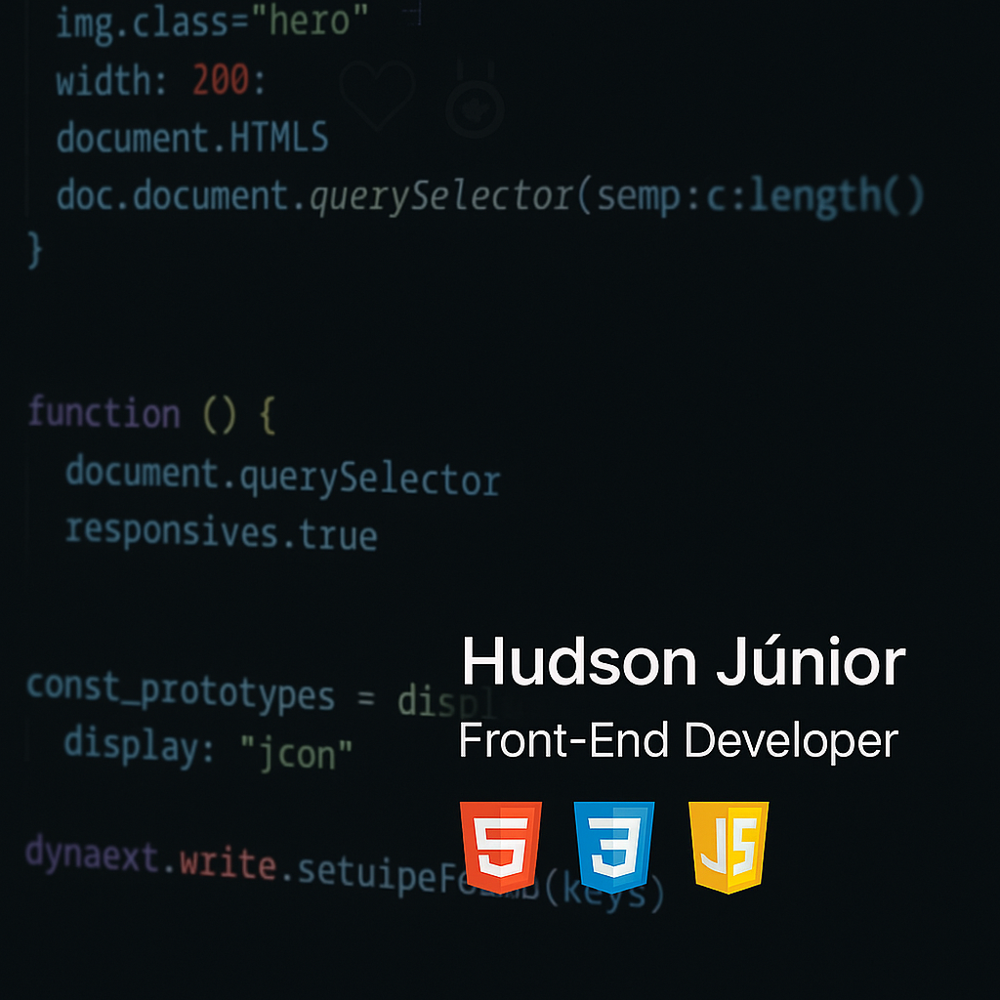

  

<h1 align="center">Olá, eu sou o Hudson Júnior!</h1>

  Desenvolvedor Front-End em formação, apaixonado por tecnologia, interfaces bonitas e funcionais, e pelo poder da prática constante.

---

## 🚀 Tecnologias que já aprendi:

---

## 📚 Atualmente estou aprendendo:

- Como tornar sites **responsivos em diferentes telas**
- Escrever HTML/CSS **semântico e limpo**
- Usar o Git e GitHub com confiança
- Praticar projetos reais do zero

---

## 🧠 Sobre mim:

- Sempre buscando melhorar a clareza e qualidade do meu código
- Acredito que **praticar** é o que transforma curiosidade em habilidade
- Em busca do primeiro passo profissional como desenvolvedor Front-End

---

## 🌐 Onde me encontrar:

---

## 📊 Meus status no GitHub:

  
  

---
## 🌍 English Version

<h1 align="center">Hi, I'm Hudson Júnior!</h1>

  A Front-End developer in training, passionate about technology, clean design, and the power of learning by doing.

---

## 🚀 Technologies I've already learned:

---

## 📚 Currently learning:

- How to build **responsive websites** for any screen size
- Writing clean and **semantic HTML/CSS**
- Using Git and GitHub confidently
- Developing real-world projects from scratch

---

## 🧠 About me:

- Always looking to improve clarity and code quality
- I believe that **practice** is what turns curiosity into skill
- Looking for my first opportunity as a Front-End developer

---

## 🌐 Where to find me:

---

## 📊 My GitHub Stats:

  
  

